<h1>👨‍💻 About Me</h1>
<h3>I'm a Business Intelligence Analyst and Developer</h3>

- ✝️ I'm Christian

- 🔭 I work at [**Vert Analytics**](https://www.vertanalytics.com.br) as a **SAS BI Analyst**

- 💬 Ask me how I build and automate data analytics solutions using **SAS Job Execution, HTML, CSS, and JavaScript**.

- 📫 You can reach me at **arthur.diego.pereira@gmail.com**

- 😄 Did you like it? Did I help you with something? How about **buying me a coffee?** ☕

😉 PIX? Click here!

<h3>My Social Networks</h3>

<h3>Languages and Tools</h3>

 

